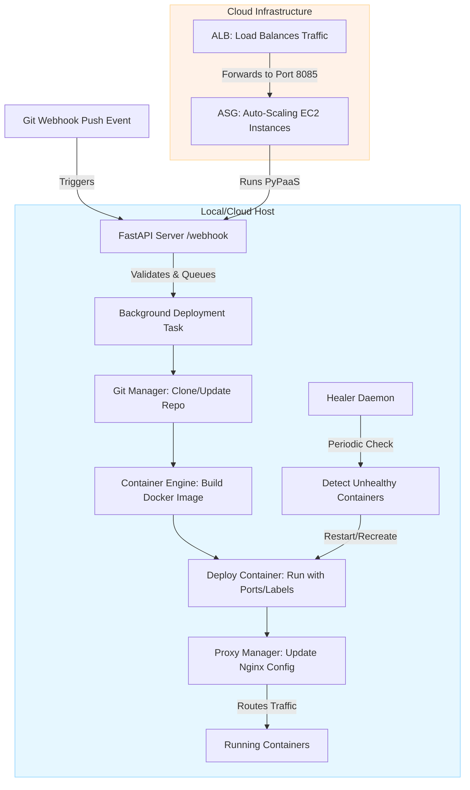

# PyPaaS - Git Deploy Healer

<!-- Badges -->
[](https://github.com/AlinaSHforwork/git-deploy-healer/actions)
[](https://opensource.org/licenses/MIT)

## Overview

PyPaaS (Python Platform-as-a-Service) is a lightweight, open-source engine designed to automate application deployments from Git repositories. It handles webhooks for push events, builds Docker images, deploys containers with zero-downtime routing via Nginx reverse proxy, and includes a self-healing daemon to restart crashed containers. Inspired by Heroku and Kubernetes, it provides Git-Ops workflows, a monitoring dashboard, and Prometheus metrics integration. This project is ideal for developers seeking a simple PaaS for local development or cloud deployment showcases.

Built with DevOps best practices in mind, it includes CI/CD pipelines, Infrastructure-as-Code (IaC) with Terraform for AWS, and security enhancements for production-like environments.

## Features

- **Automated Deployments**: Trigger builds and deploys via Git webhooks (e.g., from GitHub/GitLab).
- **Zero-Downtime Routing**: Manages Nginx configurations for seamless updates.
- **Self-Healing**: Daemon monitors and restarts/recreates failed containers.
- **Monitoring & Observability**: Prometheus metrics for deployments, restarts, and active containers; simple web dashboard.
- **CLI Tool**: Manual build/deploy via `main.py`.
- **Cloud-Ready IaC**: Terraform for AWS setup with VPC, Auto Scaling Group (ASG), Application Load Balancer (ALB), multi-AZ redundancy, and IAM roles.
- **CI/CD Pipeline**: GitHub Actions for linting, testing, Docker builds, security scans, and Terraform validation.
- **Security Enhancements**: Restricted security groups, non-root Docker runs, API key authentication, health checks.
- **Extensibility**: Supports environment variables from `.env` files; dynamic port detection from Dockerfiles.

## Architecture
PyPaaS runs as a FastAPI service (port 8085) with background tasks for deployments. The healer uses asyncio for periodic checks. In cloud mode, Terraform provisions scalable infrastructure.
Here's a visual representation of the architecture using Mermaid:


This diagram shows the core flow from Git webhook to deployment and healing, with an overlay for cloud scaling via AWS ALB and ASG.

## Tech Stack

- **Core**: Python 3.12, FastAPI, Uvicorn, Docker SDK, GitPython, Jinja2, Loguru, Pydantic, Prometheus-client.
- **Infrastructure**: Docker for containerization, Nginx for proxying, Terraform (HCL) for AWS IaC.
- **DevOps**: GitHub Actions (CI/CD), Flake8/Pytest (linting/testing), Trivy (security scans).
- **Other**: Ansible for provisioning (optional), Prometheus for metrics.

## Prerequisites

- Python 3.12+
- Docker (with Docker Compose for local setup)
- Git
- Nginx (for proxying)
- Terraform (for cloud IaC)
- AWS account (for showcase; free tier eligible)

## Local Setup

1. **Clone the Repository**:
   ```
   git clone https://github.com/AlinaSHforwork/git-deploy-healer.git
   cd git-deploy-healer
   ```

2. **Install Dependencies**:
   ```
   pip install -r requirements.txt
   ```

3. **Run the Server**:
   ```
   uvicorn api.server:app --host 0.0.0.0 --port 8085
   ```
   - Access dashboard at `http://localhost:8085/`.
   - Prometheus metrics at `http://localhost:8085/metrics`.

4. **Deploy a Sample App**:
   - Use the included `repos/my-webapp/` as an example (simple web app with Dockerfile).
   - Manually via CLI: `python main.py my-webapp repos/my-webapp`.
   - Via webhook: Simulate a Git push to `/webhook` endpoint with payload `{ "repository": { "name": "my-webapp", "clone_url": "path/to/repo" } }`.
   - App URL: `http://localhost:<host_port>` (logged after deploy).

5. **Nginx Proxy Setup**:
   - Configure Nginx to proxy subdomains (e.g., `app-name.localhost`) to container ports.
   - Example config in `core/proxy_manager.py` – reload Nginx after deploys.

6. **Testing**:
   ```
   pytest
   flake8 .
   ```

## Cloud Deployment (AWS)

**Note**: Replace variables (e.g., AMI ID, public key) in `variables.tf`.

1. **Initialize Terraform**:
   ```
   terraform init
   ```

2. **Plan and Apply** (Dry Run Recommended):
   ```
   terraform plan
   terraform apply
   ```
   - Outputs ALB DNS for access (e.g., `http://<alb-dns>/` for dashboard).
   - Infrastructure: VPC, multi-AZ subnets, ASG (1-3 instances), ALB, security groups (restricted ingress), IAM role for SSM.

3. **Provisioning**:
   - Use Ansible (in `ansible/`) or user data in launch template for installing Docker/Nginx on EC2.
   - Example: `ansible-playbook ansible/provision.yml -i <ec2-ip>,`.

4. **Access**:
   - SSH: `ssh -i ~/.ssh/id_rsa ubuntu@<ec2-public-ip>`.
   - Deploy apps as in local setup; ALB handles load balancing.

5. **Teardown**:
   ```
   terraform destroy
   ```

## CI/CD Pipeline

Integrated via GitHub Actions (`.github/workflows/ci.yml`):
- **Triggers**: Push/PR to main.
- **Jobs**: Lint (Flake8), Test (Pytest with coverage), Build (Docker), Security Scan (Trivy), Terraform Validate/Plan.
- Add secrets (e.g., `CODECOV_TOKEN`) in repo settings.
- For full CD, uncomment deploy job with AWS credentials (secrets: `AWS_ACCESS_KEY_ID`, `AWS_SECRET_ACCESS_KEY`).

## Production Hardening

- **Security**: Use API keys for webhook/dashboard (set `API_KEY` env var). Enable HTTPS on ALB with ACM certificate. Restrict `allowed_ips` in Terraform.
- **Scaling**: ASG auto-scales based on CPU (add policies). Use ECS/EKS for advanced container orchestration.
- **Monitoring**: Export Prometheus to Grafana/CloudWatch. Add alerts for healer restarts.
- **Secrets**: Integrate AWS SSM or HashiCorp Vault for env vars.
- **Backups**: S3 for repo snapshots/logs.
- **Environment Separation**: Use Terraform workspaces for dev/staging/prod.

## Troubleshooting

- **Docker Build Fails**: Check Dockerfile in app repo; ensure no missing deps.
- **Container Not Running**: Inspect logs with `docker logs <id>`; simulate crashes to test healer.
- **Webhook Errors**: Validate payload; ensure Git clone URL is accessible.
- **Terraform Issues**: Verify AWS creds; use `terraform validate`.

## License

MIT License. See [LICENSE](LICENSE) for details.

