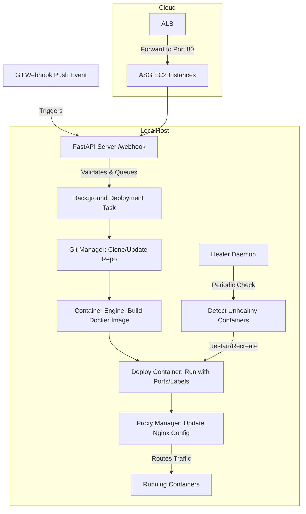

# **PyPaaS – Git Deploy Healer**

[](https://github.com/AlinaSHforwork/git-deploy-healer/actions)
[](https://opensource.org/licenses/MIT)

PyPaaS is a lightweight, developer‑friendly Platform‑as‑a‑Service engine that automates deployments from Git repositories. It builds Docker images, deploys containers, updates Nginx routing, and includes a self‑healing daemon to restart unhealthy apps. Inspired by Heroku and Kubernetes, PyPaaS brings Git‑Ops workflows, observability, and cloud‑ready infrastructure — without the complexity.

**Ideal for:**
- Local development PaaS
- Self‑hosted mini‑cloud
- DevOps learning projects
- Deployment automation demos

---

## **Features**

- **Automated Git Deployments**
  Webhook‑driven builds and deploys from GitHub/GitLab.

- **Zero‑Downtime Routing**
  Nginx reverse proxy updates with atomic config swaps.

- **Self‑Healing Engine**
  Background daemon detects unhealthy containers and restarts them automatically.

- **Observability**
  Prometheus metrics for deploys, restarts, and active apps.

- **CLI Tooling**
  Manual deploys via `main.py` or API.

- **Cloud‑Ready IaC**
  Terraform modules for AWS (VPC, ALB, ASG, IAM, multi‑AZ).

- **CI/CD Pipeline**
  GitHub Actions for linting, testing, Docker builds, security scans, and Terraform validation.

- **Security**
  API key authentication, non‑root Docker runs, restricted security groups.

- **Extensible**
  `.env`‑based configuration, pluggable secrets manager (local or AWS SSM), dynamic port detection.

---

## **Architecture**

PyPaaS runs as a FastAPI service (default port `8080`) backed by PostgreSQL and Nginx.



---

## **Tech Stack**

* **Backend:** Python 3.12, FastAPI, Uvicorn
* **Database:** PostgreSQL 15 (Dockerized)
* **DevOps:** Docker SDK, GitPython, Prometheus, Loguru
* **Infra:** Nginx, Terraform, AWS (optional)
* **CI/CD:** GitHub Actions, Pytest, Flake8, Trivy

---

## **Prerequisites**

* Docker Engine & Docker Compose
* Git
* AWS Account (Optional, for cloud deployment)
* Terraform (Optional, for AWS)

---

## **Local Setup (Docker Compose)**

The easiest way to run PyPaaS locally is via Docker Compose, which spins up the API, Nginx, and PostgreSQL database automatically.

### 1. Clone the repository

```bash
git clone [https://github.com/AlinaSHforwork/git-deploy-healer.git](https://github.com/AlinaSHforwork/git-deploy-healer.git)
cd git-deploy-healer

```

### 2. Configure Environment

Create a `.env` file in the root directory. You can copy the example below:

```bash
# .env
DEPLOYMENT_MODE=local
APP_PORT=8080

# Database Config
POSTGRES_USER=custom_user
POSTGRES_PASSWORD=secure_password
POSTGRES_DB=postgres
POSTGRES_HOST=db
POSTGRES_PORT=5432
DATABASE_URL=postgresql://${POSTGRES_USER}:${POSTGRES_PASSWORD}@${POSTGRES_HOST}:${POSTGRES_PORT}/${POSTGRES_DB}

# Security
API_KEY=my-super-secret-key
GITHUB_WEBHOOK_SECRET=my-webhook-secret

```

### 3. Run the Stack

Start the application and database containers:

```bash
docker-compose up --build

```

* **Dashboard:** http://localhost:8080/dashboard
* **API Docs:** http://localhost:8080/docs
* **Metrics:** http://localhost:8080/metrics

### 4. Deploy a Sample App

You can trigger a deployment via the API:

```bash
curl -X POST "http://localhost:8080/api/deploy" \
     -H "Content-Type: application/json" \
     -H "X-API-Key: my-super-secret-key" \
     -d '{
           "repo_url": "[https://github.com/AlinaSHforwork/git-deploy-healer.git](https://github.com/AlinaSHforwork/git-deploy-healer.git)",
           "app_name": "test-app",
           "branch": "main"
         }'

```

### 5. Run Tests

You can run the test suite inside the container or locally (if you have a virtual environment).

**Inside Docker:**

```bash
docker-compose exec app pytest tests/unit/ -v

```

**Locally:**

```bash
pip install -r requirements.txt
pytest tests/unit/ -v

```

---

## **Cloud Deployment (AWS)**

Terraform provisions a production-ready environment including:

* VPC + Private/Public Subnets
* Application Load Balancer (ALB)
* Auto Scaling Group (ASG)
* IAM Roles & Security Groups

### 1. Initialize Terraform

```bash
cd terraform
terraform init

```

### 2. Plan & Apply

```bash
terraform plan
terraform apply

```

### 3. Provisioning

Once the infrastructure is up, you can use Ansible or User Data scripts to bootstrap the EC2 instances.

### 4. Cleanup

```bash
terraform destroy

```

---

## **CI/CD Pipeline**

This repository includes a GitHub Actions workflow (`ci.yml`) that performs:

* **Linting:** Flake8 compliance
* **Testing:** Pytest with coverage reporting
* **Security:** Trivy filesystem scan
* **Build:** Docker image build verification
* **IaC:** Terraform validation

**Required Secrets for Actions:**

* `AWS_ACCESS_KEY_ID`
* `AWS_SECRET_ACCESS_KEY`
* `CODECOV_TOKEN` (optional)

---

## **Production Considerations**

For a production environment, consider the following hardening steps:

* **Secrets:** Use AWS SSM Parameter Store or HashiCorp Vault instead of `.env` files.
* **HTTPS:** Enable SSL/TLS termination at the ALB level using AWS ACM.
* **Network:** Restrict Security Groups to allow traffic only from the ALB.
* **Monitoring:** Export Prometheus metrics to Grafana or CloudWatch.

---

## **Troubleshooting**

* **Database Connection Fails:** Ensure the `db` container is healthy and `DATABASE_URL` in `.env` matches the Postgres credentials.
* **Docker Build Fails:** Check the `Dockerfile` in the target repository.
* **Webhook 403/401:** Verify `X-API-Key` or Webhook Secret matches your `.env`.

---

## **License**

MIT License — see [LICENSE](https://www.google.com/search?q=LICENSE).
